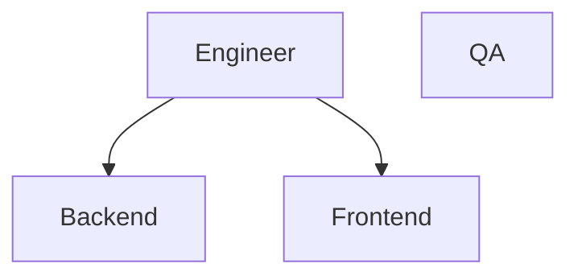

# Software Engineering Roles Definition and Carrer Paths

Welcome to Iberia's comprehensive repository for Software Engineering (SwE) roles and career paths. The primary objective of these documents is to establish a unified understanding of expectations, skills, and technology knowledge for all of our technical roles. Additionally, this repository aims to provide clear career paths to guide our engineers in their professional growth.

## Roles and Job Descriptions

To facilitate the recruitment process and align expectations, we have provided a [template](./job_descriptions/README.md) for job descriptions.
Explore specific roles:

- [Cloud Engineer](./job_descriptions/cloud_engineer.md)
- [Principal Cloud Architect](./job_descriptions/principal_cloud_architect.md)
- [QA Engineer](./job_descriptions/qa_engineer.md)
- [QA Lead](./job_descriptions/qa_lead.md)
- [QA Manager](./job_descriptions/qa_manager.md)
- [Software Engineer](./job_descriptions/software_engineer.md)
- [Tech Lead (TL)](./job_descriptions/tech_lead.md)
- [Developer Relations Manager](./job_descriptions/devrel.md)
- [Principal Engineer](./job_descriptions/principal_engineer.md)
- [Solutions Architect (SA)](./job_descriptions/solution_architect.md)
- [Principal Solutions Architect](./job_descriptions/principal_solutions_architect.md)
- [Stack (UX/UI, QA...) Lead ](./job_descriptions/stack_lead.md)
- [Subject Matter Expert (SME)](./job_descriptions/subject_matter_expert.md)
- [Scrum Master](./job_descriptions/scrum_master.md)

### Technology stack

Complementing the role and job description, the [technology stack](./technology_stack.md) defines the technology expertise for each one.

## Career paths

Explore well-defined career paths for each role, categorized into different levels.

You have a broad definition for the carrer paths in [Software engineering](swe_competency_matrix.md), and the specialization of each path.,

### Paths

A career path might have things in common with another one, in which case we will extract these common competencies. Here you can find them.

- [Backend career path](./career_paths/backend.md)
- [Frontend career path](./career_paths/frontend.md)
- [QA career path](./career_paths/qa.md)

### Levels

Junior (1)  
Junior Advance (2)  
Semi-Senior (3)  
Semi-Senior Advance (4)  
Senior (5)   
Team Leader (6)

### Specific trainings

We currently offer a dedicated product to track the career progression of select engineers and provide tailored trainings. Although the goal is to extend this offering to all engineers in the future, at present, access is limited to participants in the academy program.

Training paths are available for the following roles:

- [Software Engineer](./training_paths/engineer_material.md)
    - [Backend Developer](./training_paths/backend_material.md)
    - [Frontend Developer](./training_paths/frontend_material.md)
        - [Frontend Angular Developer](./training_paths/frontend_angular_material.md)
        - [Frontend React Developer](./training_paths/frontend_react_material.md)
    - [QA Engineer](./training_paths/qa_engineer.md)

If you are eager to enhance your skills and are uncertain about the next steps, please contact your technical lead or [reach out to us](#contact).

### Questions

Currently these skills are accompanied by coaches and mentors in the academy programme. If you are outside of the programme and have any question (e.g. You are not sure what a skill means, or how to evaluate if someboy has certain skill or level) feel free to [contact us](#contact).

## Contact

Feel free to open any issue or contribution following our [Innersource standards](https://github.com/Iberia-Ent/software-engineering--innersource--standards).

*Software Engineering - Patterns & Practices*