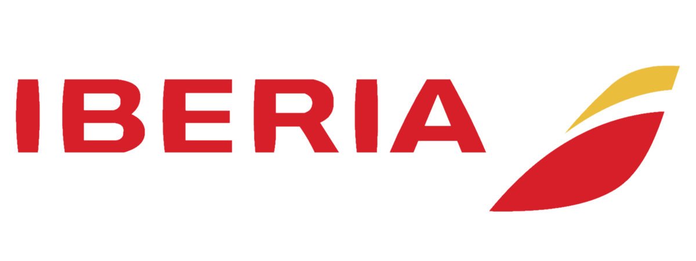

# Stack (UX/QA/Backend...) Lead 

## Your Impact

Join us as a pivotal member of our dynamic team, taking on the role of Stack (UX/QA/Backend...) Lead. Your expertise will shape the technological landscape within our organization, influencing both products and people. As a beacon of innovation, you'll guide our teams toward excellence, foster growth, and champion best practices.

## Responsibilities

- **Craftsmanship Mastery**: Immerse yourself as a seasoned expert in your domain, steering projects critical to our organization.
- **Leadership**: Lead teams with finesse, instilling best practices and utilizing cutting-edge tools within your mastered technologies.
- **Project Stewardship**: Maintain and elevate key projects, impacting the work of developers across the organization.
- **Career Development**: Nurture the growth of your team members, empowering them along their career paths.
- **Representation and Advocacy**: Be the voice for your stack's community, channeling their needs and influencing decision-making.

## Expectations

- **Mentorship**: Champion and mentor people  within your mastered stack.
- **Collaboration**: Promote Pair/Mob working, provide constructive feedback in code reviews, and help improving KPIs.
- **Coordination**: Lead the process for specific user stories, production incidents, and other tasks, ensuring seamless execution.
- **Innovation**: Challenge feature implementation and identify and resolve conflicting features hands-on.
- **Best Practices**: Drive the improvement and dissemination of Best Practices and Developer Experience.
- **Tech Savvy**: Stay on the cutting edge of technology, bringing innovation to the forefront of our organization.

## Skills and Competencies

- **Technical Prowess**: In-depth knowledge and understanding of the tools and technologies within your stack.
- **Communication**: Excellent verbal and written communication skills.
- **Everything As Code**: Enforce the concept that technical matters, from documentation to infrastructure, belong in our GitHub.
- **Organizational Mastery**: Expertise in project management and organizational acumen that ensures seamless coordination, efficient workflows, and successful project execution.

## Working Style

- **Collaboration**: Work closely with cross-functional teams, bridging product, engineering, and business together.
- **Engagement**: Utilize both online and offline channels to actively engage with the community using your stack.
- **Proactive Approach**: Embrace a proactive and solutions-oriented mindset.

## Collaborative Partnerships

- **Product and Engineering Teams**: Work closely to prioritize and address developer feedback.
- **Developer Community**: Engage with the broader developer community, both online and at industry events, fostering valuable connections.

Join us on the forefront of technology, where your leadership will shape the future of our organization.
